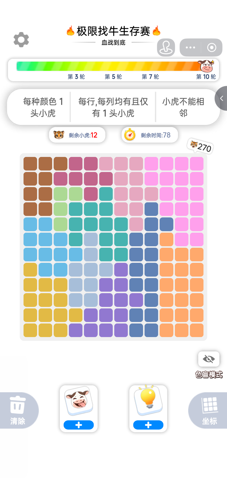

# XiaoxiaoNiu

Computer-vision and puzzle-solving project for the TikTok game "XiaoxiaoNiu".

This repository now contains:

- a Python solver that parses a screenshot, rebuilds the board, and finds every cow
- a FastAPI backend that accepts uploaded screenshots and returns frontend-ready overlay data
- a React frontend that uploads screenshots and renders animated cow markers directly on top of the image

## How It Works

The system is split into two stages:

1. Vision parsing
   - detect colored board cells from the screenshot
   - infer the square grid layout
   - sample each cell color
   - quantize the board into a 2D color-id array

2. Constraint solving
   - exactly one cow per row
   - exactly one cow per column
   - exactly one cow per connected color region
   - cows cannot touch in the 8-neighborhood

The backend returns both board coordinates and image overlay coordinates, so the frontend can draw the result directly on the uploaded screenshot.

## Project Structure

```text
Backend/
  api.py                  FastAPI app
  xiaoxiaoniu_solver.py   Vision parser + puzzle solver
  data/                   Example screenshots

Frontend/
  src/App.jsx             Main React UI
  src/styles.css          Visual system and animations
  vite.config.js          Dev proxy to FastAPI backend

pyproject.toml            Python dependencies managed by uv
uv.lock                   Locked Python dependency graph
```

## Quick Start

Run backend and frontend in separate terminals.

### 1. Start the Backend

```bash
cd XiaoxiaoNiu
uv sync
uv run uvicorn Backend.api:app --reload
```

Backend default address:

- `http://127.0.0.1:8000`

### 2. Start the Frontend

```bash
cd XiaoxiaoNiu/Frontend
npm install
npm run dev
```

Frontend default address:

- `http://127.0.0.1:5173`

In development, Vite proxies `/api` and `/healthz` to the backend automatically.

If you want the frontend to call a different backend directly, set:

```bash
VITE_API_BASE_URL=http://your-host:8000
```

## Test Image


